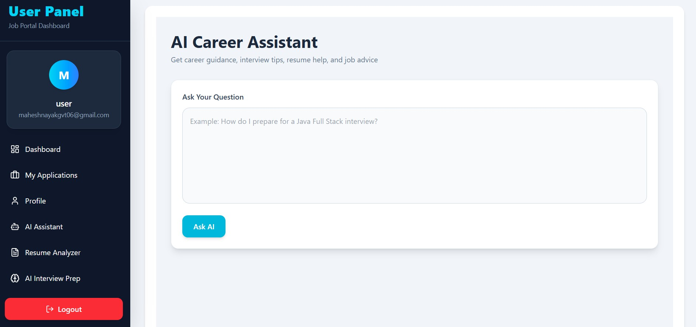

# AI Career Assistant & Job Tracker

AI Career Assistant & Job Tracker is a full-stack web application designed to help job seekers manage their career journey efficiently. The platform combines job application tracking with AI-powered features such as Resume Analysis, Interview Preparation, and Career Guidance.

## Features

### Authentication

- User Registration
- User Login
- JWT-Based Authentication
- Secure Access Control

### Job Tracking

- Add Job Applications
- Update Job Status
- Track Applied, Selected, and Rejected Jobs
- Manage Job Search Progress
- Delete Job Applications

### AI Resume Analyzer

- Resume Content Analysis
- Skill Gap Identification
- Resume Improvement Suggestions
- Career-Focused Feedback

### AI Interview Preparation

- Technical Interview Questions
- HR Interview Questions
- Personalized Interview Guidance
- Interview Practice Support

### AI Career Assistant

- Career Guidance
- Skill Recommendations
- Job Search Assistance
- Professional Growth Suggestions

## Tech Stack

### Frontend

- React.js
- Tailwind CSS
- Axios
- JavaScript
- HTML5

### Backend

- Spring Boot
- Spring Security
- JWT Authentication
- Hibernate / JPA

### Database

- MySQL

### AI Integration

- OpenRouter API

### Deployment

- Vercel (Frontend)
- Railway (Backend)
- Railway MySQL (Database)

## Architecture

Client (React + Tailwind CSS)
        ↓
Spring Boot REST API
        ↓
Spring Security + JWT
        ↓
Hibernate / JPA
        ↓
MySQL Database

AI Features
        ↓
OpenRouter API

## Live Demo

Frontend:
https://job-tracker-app-olive.vercel.app


## Screenshots

### Login Page


### Register Page


### Dashboard

## Admin Dashboard


## User Dashboard


### Job Tracking

## Job Tracking


## Job Applications


### AI Resume Analyzer


### AI Interview Preparation


### AI Carrer Assistant



## Installation

### Clone Repository

```bash
git clone https://github.com/mahesh-nayak53/job-tracker-app.git
```

### Frontend Setup

```bash
cd frontend
npm install
npm run dev
```

### Backend Setup

```bash
cd backend
mvn spring-boot:run
```

## Environment Variables

### Frontend

```env
VITE_API_URL=
```

### Backend

```env
DB_URL=
DB_USERNAME=
DB_PASSWORD=
OPENROUTER_API_KEY=
MAIL_USERNAME=
MAIL_PASSWORD=
JWT_SECRET=
```

## Key Highlights
- Role-Based Access Control (Admin/User)
- Full-Stack Web Application
- AI-Powered Resume Analysis
- AI Interview Preparation
- AI Career Guidance Assistant
- JWT Authentication & Authorization
- RESTful API Architecture
- Cloud Deployment using Vercel & Railway
- Responsive User Interface
- Real-World Project Architecture

## Future Enhancements
- AI Cover Letter Generator
- Mock Interview Simulator
- Job Recommendation System
- Email Notifications
- Analytics Dashboard
- Mobile Application

## Author

Mahesh

GitHub:
https://github.com/mahesh-nayak53
